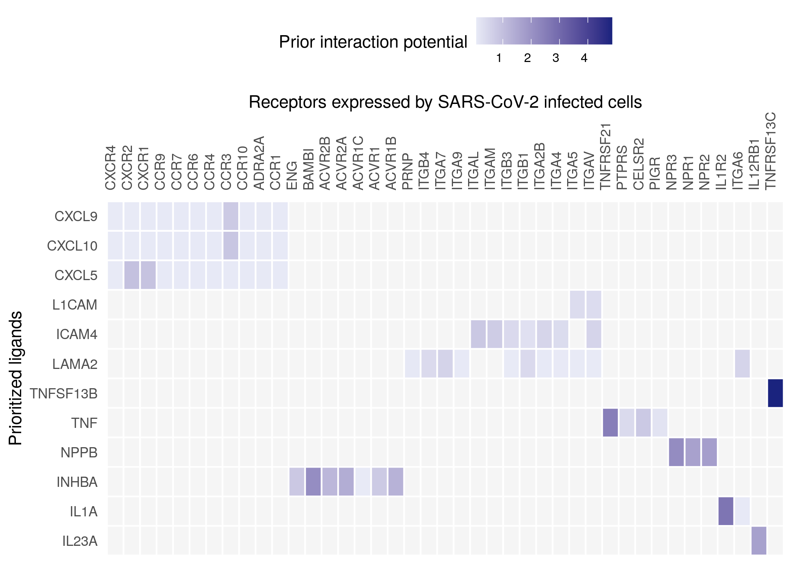
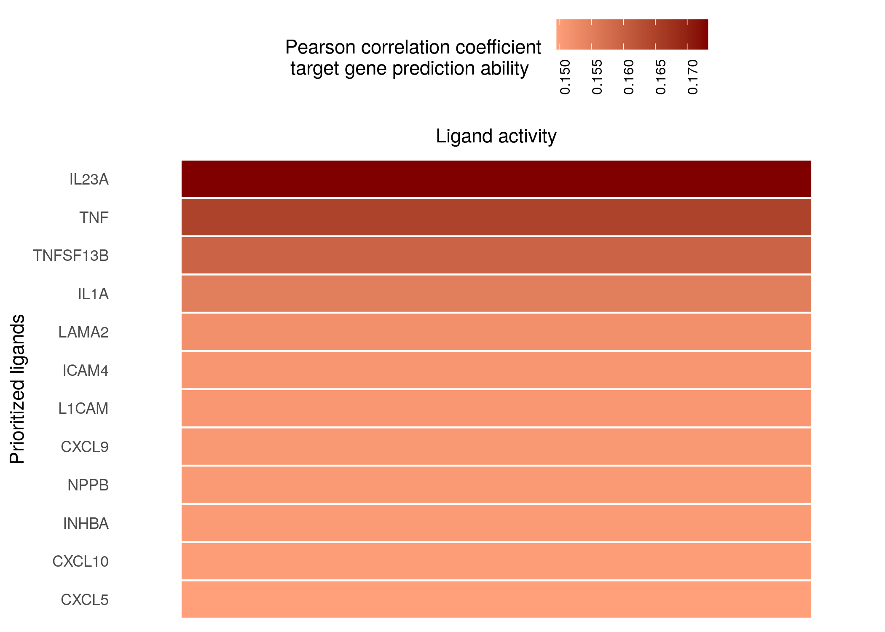
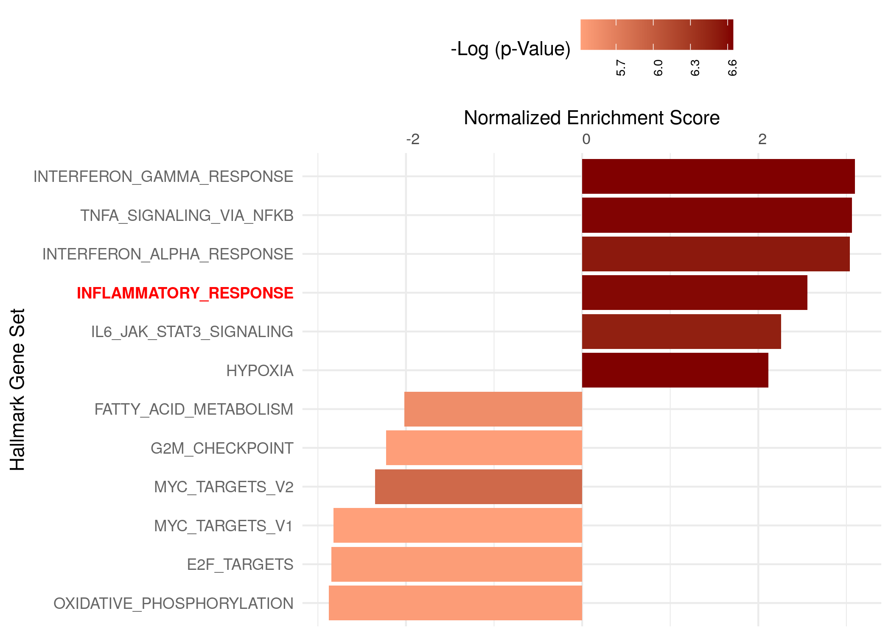
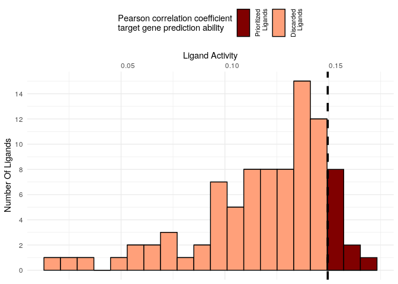
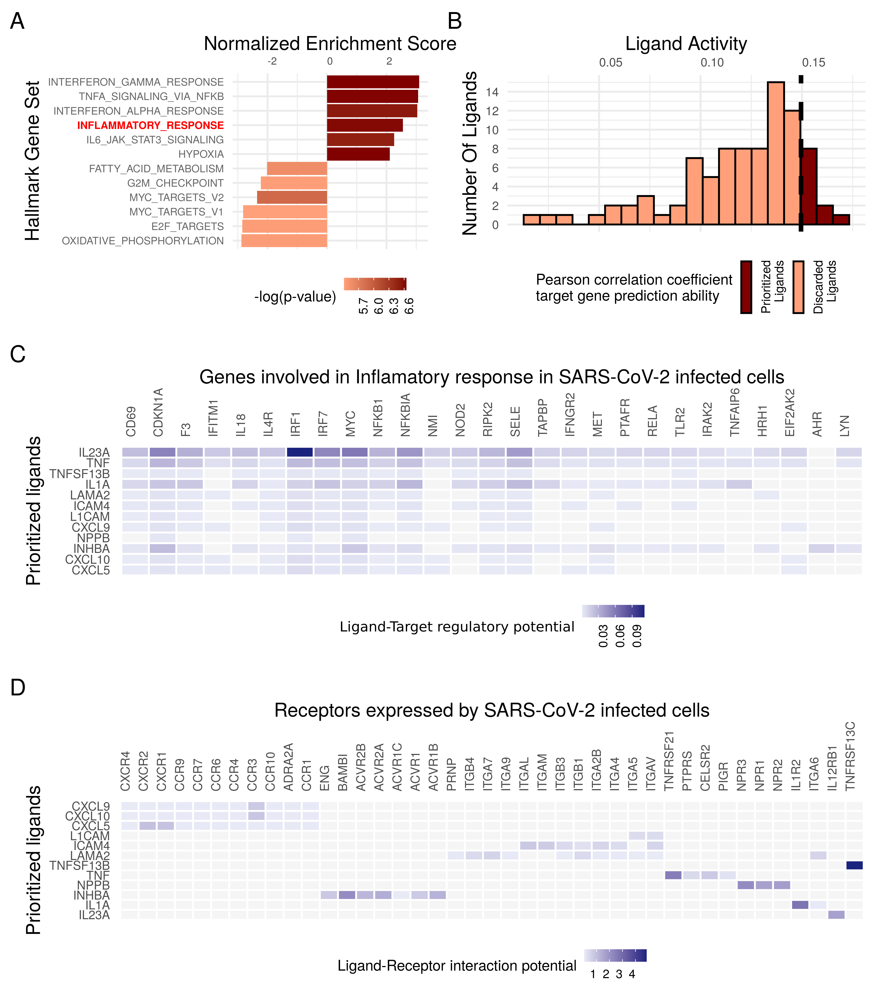

NicheNet Results Plot Arrangement
================
Alberto Valdeolivas: <alberto.valdeolivas@bioquant.uni-heidelberg.de>;
Date:
15/06/2020

## Results

This vignette contains the rearrangement of the plots obtained in the
previous markdown (05\_ligandActivityAnalysis.Rmd) for publication.

We first load the required libraries and read the previously generated
results:

``` r
library(RColorBrewer)
library(cowplot)
library(ggpubr)
library(dplyr)
library(tibble)
library(tidyr)
library(gridExtra)

TargetExpression <- readRDS(file = "Results/target_expression.rds")
LigandTarget <- readRDS(file = "Results/Ligand_Target_Matrix.rds")
LigandReceptor <- readRDS(file = "Results/Ligand_Receptor_Matrix.rds")  %>%
    t() 
LigandPearsonCor <- readRDS(file = "Results/ligand_Pearson.rds")
SignificantResults <- readRDS(file = "Results/Enrichment_Significant_Results.rds") %>%
  dplyr::mutate(pathway = gsub("HALLMARK_","", pathway))
ligand_activities <- readRDS(file = "Results/LigandActivityScoreDistribution.rds")
```

### Ligand-Target Heatmap

``` r
LigandTarget_df = LigandTarget %>% 
    data.frame() %>% 
    rownames_to_column("y") %>% 
    tbl_df() %>% 
    gather(x, "score", -y) %>% 
    mutate(y = factor(y, levels = rownames(LigandTarget), ordered = TRUE), 
           x = factor(x, levels = colnames(LigandTarget), ordered = TRUE)) %>% 
    mutate(score = ifelse(score == 0, NA, score))

plot_LigandTarget <- LigandTarget_df %>% 
    ggplot(aes(x, y, fill = score)) + 
    geom_tile(color = "white", size = 0.5) + 
    scale_fill_gradient(low = "#E8EAF6", high = "#1A237E",
                        na.value = "whitesmoke")  + 
    theme_minimal() + 
    theme(panel.grid.minor = element_line(color = "transparent"), 
          panel.grid.major = element_line(color = "transparent"), 
          legend.position = "top", 
          legend.text = element_text(size = 8, angle = 90, hjust = 1), 
          axis.ticks = element_line(size = 0), 
          axis.text.x.top = element_text(angle = 90, hjust = 0), 
          axis.text.x = element_text(angle = 90, hjust = 1), 
          axis.title = element_text(), 
          axis.text.y = element_text()) + 
          scale_x_discrete(position = "top") + 
          xlab(paste0("Genes involved in Inflamatory response in SARS-CoV-2 infected cells")) + 
          ylab(paste0("Prioritized ligands")) + 
    labs(fill = "Regulatory potential")
plot_LigandTarget
```

<!-- -->

### Ligand-Receptor Heatmap

``` r
LigandReceptor_df = LigandReceptor %>% 
    data.frame() %>% 
    rownames_to_column("y") %>% 
    tbl_df() %>% 
    gather(x, "score", -y) %>% 
    mutate(y = factor(y, levels = rev(rownames(LigandReceptor)), ordered = TRUE), 
           x = factor(x, levels = colnames(LigandReceptor), ordered = TRUE)) %>% 
    mutate(score = ifelse(score == 0, NA, score))
    
plot_LigandReceptor <- LigandReceptor_df %>% 
    ggplot(aes(x, y, fill = score)) + 
    geom_tile(color = "white", size = 0.5) + 
    scale_fill_gradient(low = "#E8EAF6", high = "#1A237E",
                        na.value = "whitesmoke") + 
    theme_minimal() + 
    theme(panel.grid.minor = element_line(color = "transparent"), 
          panel.grid.major = element_line(color = "transparent"), 
          legend.position = "top", 
          legend.text = element_text(size = 8, hjust = 1), 
          axis.ticks = element_line(size = 0), 
          axis.text.x.top = element_text(angle = 90, hjust = 0), 
          axis.text.x = element_text(angle = 90, hjust = 1), 
          axis.title = element_text(), 
          axis.text.y = element_text()) + 
          scale_x_discrete(position = "top") + 
          xlab(paste0("Receptors expressed by SARS-CoV-2 infected cells")) + 
          ylab(paste0("Prioritized ligands")) + 
    labs(fill = "Prior interaction potential")
plot_LigandReceptor
```

<!-- -->

### Ligand-Targets Pearson Correlation

``` r
LigandPearsonCor_df = LigandPearsonCor %>% 
    data.frame() %>% 
    rownames_to_column("y") %>% 
    tbl_df() %>% 
    gather(x, "score", -y) %>% 
    mutate(y = factor(y, levels = rownames(LigandPearsonCor), ordered = TRUE), 
           x = factor(x, levels = colnames(LigandPearsonCor), ordered = TRUE)) %>% 
    mutate(score = ifelse(score == 0, NA, score))
    
plot_LigandPearsonCor <- LigandPearsonCor_df %>% 
    ggplot(aes(x, y, fill = score)) + 
    geom_tile(color = "white", size = 0.5) + 
    scale_fill_gradient(low = "#FFA07A", high = "#800000", 
                        na.value = "whitesmoke") + 
    theme_minimal() + 
    theme(panel.grid.minor = element_line(color = "transparent"), 
          panel.grid.major = element_line(color = "transparent"), 
          legend.position = "top", 
          legend.text = element_text(size = 8, hjust = 1, angle = 90), 
          axis.ticks = element_line(size = 0), 
          axis.text.x.top = element_text(angle = 90, hjust = 0), 
          axis.text.x = element_text(angle = 90, hjust = 1), 
          axis.title = element_text(), 
          axis.text.y = element_text()) + 
          scale_x_discrete(position = "top" ,labels = "") + 
          xlab(paste0("Ligand activity")) + 
          ylab(paste0("Prioritized ligands")) + 
    labs(fill = "Pearson correlation coefficient \n target gene prediction ability")
plot_LigandPearsonCor
```

<!-- -->

### Enrichment of SARS-CoV-2 Infected cells

``` r
plot_enrichment <- ggplot(SignificantResults, aes(NES, reorder(pathway, NES))) +
  geom_col(aes(fill=-log(pval))) +
  # coord_flip() +
  # labs(x="Pathway", y="Normalized Enrichment Score") + 
  scale_fill_gradient(low = "#FFA07A", high = "#800000", 
                        na.value = "whitesmoke") +   
  theme_minimal() + 
  theme(legend.position = "top", 
        legend.text = element_text(size = 7, hjust = 1, angle = 90),
        axis.text.x = element_text(angle = 0, hjust = 0), 
        axis.text.y = element_text(angle = 0, hjust = 1,
          colour = ifelse(levels(reorder(SignificantResults$pathway, 
                SignificantResults$NES)) == "INFLAMMATORY_RESPONSE" ,
                "red", "grey40"),
            face = ifelse(levels(reorder(SignificantResults$pathway, 
                SignificantResults$NES)) == "INFLAMMATORY_RESPONSE", 
                "bold", "plain")),
 ) + 
        ylab(paste0("Hallmark Gene Set")) + 
        xlab(paste0("Normalized Enrichment Score")) + 
        labs(fill = "-Log (p-Value)") + 
  scale_x_continuous(position = "top") 

        #
        #axis.text.x = element_text(angle = 0, hjust = 1), 
        #axis.title = element_text(),   
        #axis.text.y = element_text(angle = 0, hjust = 1)) + 
        #scale_y_discrete(position = "top") + 
        #xlab(paste0("Hallmark Gene Signatures")) + 
        #ylab(paste0("Normalized Enrichment Score")) + 
        #labs(fill = "-log(p-value)")
plot_enrichment
```

<!-- -->

### Ligand Activity: Pearson Correlation coefficients distribution

``` r
cut_off_Value <- min(ligand_activities %>% top_n(12, pearson) %>% pull(pearson)) 
ligand_activities_color <- ligand_activities %>% 
  mutate(pcc_color = ifelse(pearson <= cut_off_Value, "#FFA07A", "#800000")) %>% 
  mutate(pcc_color = as.factor(pcc_color))

bins <- seq(min(ligand_activities_color$pearson), 
            max(ligand_activities_color$pearson),
            length.out = 21)    
bins <- c(bins, cut_off_Value) %>% sort()

p_hist_lig_activity = ggplot(
  ligand_activities_color, 
  aes(x=pearson, fill=pcc_color)) + 
  geom_histogram(color= "black", breaks = bins) + 
  geom_vline(aes(xintercept=min(ligand_activities %>% top_n(12, pearson) %>% 
    pull(pearson))), color="black", linetype="dashed", size=1.25) + 
  theme_minimal() + 
  ylab(paste0("Number Of Ligands")) + 
        xlab(paste0("Ligand Activity")) + 
  labs(fill = "Pearson correlation coefficient\ntarget gene prediction ability") +
  scale_x_continuous(position = "top") + 
  scale_y_continuous(breaks = seq(0, 14, by = 2)) + 
  scale_fill_manual(labels = c("Prioritized\nLigands", "Discarded\nLigands"),   
                    values=levels(ligand_activities_color$pcc_color)) + 
   theme(legend.position = "top", 
        legend.text = element_text(size = 8, hjust = 1, angle = 90),
        axis.text.x = element_text(angle = 0, hjust = 0), 
        axis.text.y = element_text(angle = 0, hjust = 1)) 
p_hist_lig_activity
```

<!-- -->

### Combine plots in a single Figure

``` r
spaceLegend <- 0.5
lay <- rbind(c(1,1,2,2),
             c(3,3,3,3),
             c(4,4,4,4))

plot_enrichment_final <- 
  plot_enrichment + 
      theme(legend.position = "bottom", axis.ticks = element_blank()) +
        theme(axis.title.x = element_text(),
              axis.text = element_text(size = 6)) + 
        theme(legend.title = element_text(size=8.5), 
          legend.text = element_text(size=7, angle = 90), 
          legend.key.size = unit(spaceLegend, "lines")) +
          labs(fill = "-log(p-value)", tag="A")

p_hist_lig_activity_final <- 
  p_hist_lig_activity + 
    theme(legend.position = "bottom", axis.ticks = element_blank()) + 
    theme(axis.title.x = element_text(), 
          axis.text = element_text(size = 7)) +
    theme(legend.title = element_text(size=8.5), 
          legend.text = element_text(size=7, angle = 90), 
          legend.key.size = unit(spaceLegend, "lines")) + 
          labs(tag = "B")
        

plot_LigandTarget_final <- 
    plot_LigandTarget + 
        theme(legend.position = "bottom", axis.ticks = element_blank()) + 
        theme(axis.title.x = element_text(), 
              axis.text = element_text(size = 7)) + # ylab("") +
        theme(legend.title = element_text(size=8,5), 
          legend.text = element_text(size=7, angle = 90), 
          legend.key.size = unit(spaceLegend, "lines")) + 
          labs(fill = "Ligand-Target regulatory potential", tag = "C")

plot_LigandReceptor_final <- 
    plot_LigandReceptor + 
        theme(legend.position = "bottom", axis.ticks = element_blank(),
              axis.text = element_text(size = 7)) + 
        # ylab("") + 
        theme(legend.title = element_text(size=8.5), 
          legend.text = element_text(size=7, angle = 0), 
          legend.key.size = unit(spaceLegend, "lines")) +
          labs(fill = "Ligand-Receptor interaction potential", tag = "D")

figures_with_legend <- 
    grid.arrange(plot_enrichment_final, p_hist_lig_activity_final,
    plot_LigandTarget_final, plot_LigandReceptor_final, 
    layout_matrix = lay) 
```

<!-- -->

``` r
figures_with_legend
## TableGrob (3 x 4) "arrange": 4 grobs
##   z     cells    name           grob
## 1 1 (1-1,1-2) arrange gtable[layout]
## 2 2 (1-1,3-4) arrange gtable[layout]
## 3 3 (2-2,1-4) arrange gtable[layout]
## 4 4 (3-3,1-4) arrange gtable[layout]
```

``` r
ggsave(filename = "Results/MegeHeatmaps.eps", plot=figures_with_legend, 
       device = "eps",  dpi = 600, limitsize = FALSE, width=6, height=8, 
       units = c("in"))
ggsave(filename = "Results/MegeHeatmaps.png", plot=figures_with_legend,
       device = "png",  dpi = 600, limitsize = FALSE, width=6, height=8, 
       units = c("in"))
ggsave(filename = "Results/MegaHeatmaps.svg", plot=figures_with_legend,
       device = "svg",  dpi = 600, limitsize = FALSE, width=6, height=8, 
       units = c("in"))
```
